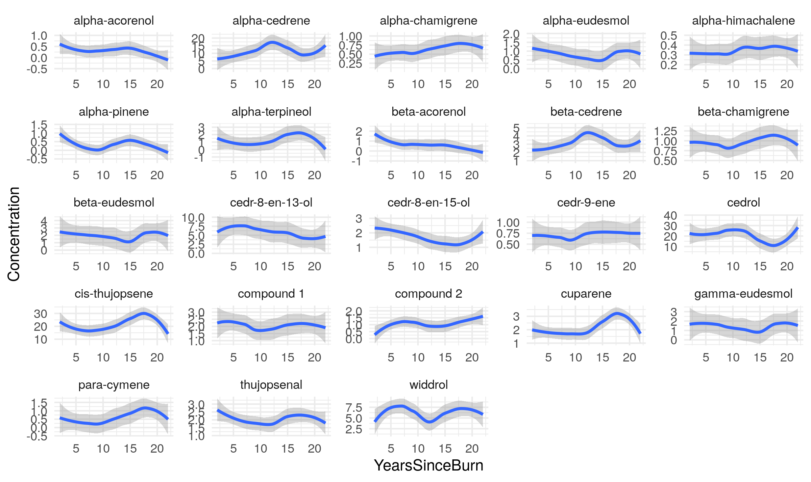

```{r setup, include=FALSE}
knitr::opts_chunk$set(echo = TRUE, message = FALSE, warning = FALSE)
library(tidyverse)
library(janitor)
library(broom)
```

#### Task 1 --- Faculty Salaries (1995) ---

```{r}
knitr::include_graphics("Fig1.png")
```

### Load the data

```{r pressure, echo=FALSE}
sal_raw <- read_csv("FacultySalaries_1995.csv") %>%
clean_names()

glimpse(sal_raw)
head(sal_raw)
names(sal_raw)
```

### Clean and tidy the data
```{r}
if (!("state" %in% names(sal_raw))) {
state_guess <- names(sal_raw)[str_detect(names(sal_raw), "state|st")][1]
sal_raw <- sal_raw %>% rename(state = all_of(state_guess))
}
## Tidy salaries into long format (Rank + Salary)
sal_tidy <- sal_raw %>%
  transmute(
    fed_id = fed_id,
    univ_name = univ_name,
    state = state,
    tier = tier,
    avg_full_prof_salary,
    avg_assoc_prof_salary,
    avg_assist_prof_salary
    # do NOT include avg_prof_salary_all
  ) %>%
  pivot_longer(
    cols = starts_with("avg_") & ends_with("_salary"),
    names_to = "salary_type",
    values_to = "salary"
  ) %>%
  mutate(
    Rank = case_when(
      str_detect(salary_type, "full")   ~ "Full",
      str_detect(salary_type, "assoc")  ~ "Associate",
      str_detect(salary_type, "assist") ~ "Assistant",
      TRUE ~ NA_character_
    ),
    Rank = factor(Rank, levels = c("Assistant", "Associate", "Full")),
    state = as.factor(state),
    tier  = as.factor(tier),
    salary = as.numeric(salary)
  ) %>%
  drop_na(Rank, salary)

glimpse(sal_tidy)
```

### Fig 1 recreation 
```{r}
ggplot(sal_tidy, aes(x = Rank, y = salary)) +
  geom_boxplot() +
  facet_wrap(~ tier) +
  theme_minimal()
labs(x = "Rank", y = "Salary")
```

#### Task 2 --- ANOVA ---
```{r}
anova_fit <- aov(salary ~ state + tier + Rank, data = sal_tidy)
summary(anova_fit)
```

#### Task 3 --- Juniper Oils ---
```{r}
jun_raw <- read_csv("Juniper_Oils.csv") %>%
  clean_names()

glimpse(jun_raw)
head(jun_raw)
names(jun_raw)
```
### Clean and tidy the data
```{r}
# Chemical columns provided in the instructions
chem_cols <- c(
  "alpha-pinene","para-cymene","alpha-terpineol","cedr-9-ene","alpha-cedrene",
  "beta-cedrene","cis-thujopsene","alpha-himachalene","beta-chamigrene","cuparene",
  "compound 1","alpha-chamigrene","widdrol","cedrol","beta-acorenol","alpha-acorenol",
  "gamma-eudesmol","beta-eudesmol","alpha-eudesmol","cedr-8-en-13-ol","cedr-8-en-15-ol",
  "compound 2","thujopsenal"
)

# Convert to snake_case to match clean_names()
chem_cols_clean <- chem_cols %>%
  stringr::str_to_lower() %>%
  stringr::str_replace_all("[^a-z0-9]+", "_") %>%
  stringr::str_replace_all("^_|_$", "")

# Tidy the data (wide → long)
jun_tidy <- jun_raw %>%
  pivot_longer(
    cols = all_of(chem_cols_clean),
    names_to = "ChemicalID",
    values_to = "Concentration"
  ) %>%
  mutate(
    YearsSinceBurn = as.numeric(years_since_burn),
    Concentration  = as.numeric(Concentration),
    ChemicalID     = factor(ChemicalID)
  ) %>%
  drop_na(YearsSinceBurn, Concentration)

# Sanity check — MUST be 23
n_distinct(jun_tidy$ChemicalID)
glimpse(jun_tidy)
```

#### Task 4 --- Faceted plot ---
```{r fig2_reference, echo=FALSE, fig.align='center', fig.width=5, fig.height=5}

```
```{r}
ggplot(jun_tidy, aes(x = YearsSinceBurn, y = Concentration)) +
geom_point() +
geom_smooth(method = "lm", se = FALSE) +
facet_wrap(~ ChemicalID, scales = "free_y") +
labs(x = "Years Since Burn", y = "Concentration") +
theme_minimal()
```
#### Task 5 --- Table of Significant Terms --- 
# which chemicals are significantly affected by Years Since Burn?
```{r}
glm_results <- jun_tidy %>%
  group_by(ChemicalID) %>%
  do(
    tidy(
      glm(
        Concentration ~ YearsSinceBurn,
        data = .,
        family = gaussian()
      )
    )
  ) %>%
  ungroup()

# Keep only the YearsSinceBurn term
sig_terms <- glm_results %>%
  filter(term == "YearsSinceBurn") %>%
  filter(p.value < 0.05) %>%
  mutate(
    term = as.character(ChemicalID)
  ) %>%
  select(term, estimate, std.error, statistic, p.value) %>%
  arrange(p.value)

sig_terms
```

